# Requisitos e Modelagem UML - Projeto Artipica

## 1. Visao Geral

O Projeto Artipica e uma aplicacao web para exposicao e administracao de produtos artesanais. O sistema possui uma loja publica para clientes e um painel administrativo restrito para manutencao dos produtos.

## 2. Escopo

### 2.1 Dentro do Escopo

- Exibir vitrine publica de produtos.
- Permitir busca e filtro por categoria.
- Exibir detalhes, imagens, estoque, preco e contato do produto.
- Direcionar o cliente para atendimento via WhatsApp.
- Exibir informacoes de privacidade e consentimento LGPD.
- Permitir acesso administrativo apenas para usuario autorizado.
- Cadastrar, editar, excluir e ordenar produtos.
- Enviar imagens dos produtos para Supabase Storage.
- Gerenciar imagens cadastradas no produto.
- Trocar senha da conta administrativa.

### 2.2 Fora do Escopo

- Carrinho de compras.
- Pagamento online.
- Gestao de pedidos.
- Area de cliente autenticado.
- Controle fiscal ou emissao de nota.
- Compactacao de imagens no frontend.

## 3. Atores

| Ator | Descricao |
| --- | --- |
| Cliente | Pessoa que acessa a loja para visualizar produtos e entrar em contato. |
| Administradora | Pessoa autorizada a gerenciar produtos e imagens. |
| Supabase Auth | Servico responsavel por autenticacao da administradora. |
| Supabase Database | Servico responsavel por persistir produtos, admins e ordem. |
| Supabase Storage | Servico responsavel por armazenar imagens dos produtos. |
| WhatsApp | Canal externo usado para contato comercial. |

## 4. Requisitos Funcionais

### RF01 - Listar Produtos

O sistema deve listar os produtos cadastrados na loja publica.

Critérios de aceite:

- Produtos devem ser exibidos em cards.
- Produtos devem respeitar a ordenacao definida em `display_order`.
- Caso `display_order` ainda nao exista, o sistema deve carregar produtos por data de criacao como fallback.

### RF02 - Buscar Produtos

O sistema deve permitir busca por nome e descricao.

Critérios de aceite:

- A busca deve ser aplicada em tempo real no estado da interface.
- Produtos que nao correspondem ao termo devem ser ocultados.

### RF03 - Filtrar por Categoria

O sistema deve permitir filtrar produtos por categoria.

Critérios de aceite:

- A opcao `Todas` deve exibir todos os produtos.
- As categorias devem ser derivadas dos produtos cadastrados.

### RF04 - Visualizar Produto

O sistema deve permitir abrir um produto para visualizar seus detalhes.

Critérios de aceite:

- O modal deve mostrar imagens, nome, categoria, descricao, preco, estoque ou status de encomenda.
- O modal deve possuir acao para contato via WhatsApp.
- O modal deve permitir navegar para produto anterior ou proximo.

### RF05 - Navegar Imagens do Produto

O sistema deve permitir navegar pelas imagens de um produto.

Critérios de aceite:

- Em desktop, o modal deve oferecer controles de navegacao.
- Em mobile, o card deve permitir arrastar as imagens horizontalmente sem abrir o produto.
- O gesto vertical sobre imagens deve preservar o scroll da pagina.

### RF06 - Contato via WhatsApp

O sistema deve gerar link para WhatsApp com mensagem contextual.

Critérios de aceite:

- A mensagem deve incluir o nome do produto.
- Produtos sob encomenda ou esgotados devem usar texto de encomenda.
- Produtos disponiveis devem usar texto de pedido.

### RF07 - Consentimento LGPD

O sistema deve exibir banner de consentimento de cookies/LGPD.

Critérios de aceite:

- O aceite ou recusa deve ser salvo em `localStorage`.
- O sistema deve possuir modal de politica de privacidade.

### RF08 - Acessar Admin Oculto

O sistema deve ocultar o painel administrativo da navegacao publica.

Critérios de aceite:

- O acesso inicial deve ocorrer por `?admin=1` ou `#admin`.
- O botao `Admin` so deve aparecer apos login autorizado.
- O botao `Sair` deve aparecer enquanto a sessao administrativa estiver ativa.
- Ao sair, o botao `Admin` deve sumir novamente.

### RF09 - Autenticar Administradora

O sistema deve autenticar a administradora usando Supabase Auth.

Critérios de aceite:

- O usuario deve informar senha e, quando necessario, e-mail.
- A sessao deve ser validada com a funcao `public.is_admin()`.
- Usuarios autenticados que nao estejam em `public.admin_users` nao devem acessar o painel.

### RF10 - Cadastrar Produto

O sistema deve permitir cadastrar produto no painel administrativo.

Critérios de aceite:

- Campos obrigatorios: nome, preco, estoque quando nao for encomenda e contato.
- Produto sob encomenda deve permitir prazo de envio.
- Produto novo deve receber a proxima posicao de ordenacao.
- Escrita deve respeitar RLS no Supabase.

### RF11 - Editar Produto

O sistema deve permitir alterar dados de um produto existente.

Critérios de aceite:

- Alteracoes devem ser persistidas no Supabase.
- O estado local deve ser atualizado apos sucesso.
- Erros devem ser comunicados por toast.

### RF12 - Excluir Produto

O sistema deve permitir excluir produto mediante confirmacao.

Critérios de aceite:

- A exclusao deve exigir confirmacao.
- O produto deve ser removido do estado local apos sucesso.
- A operacao deve ser restrita a admins.

### RF13 - Ordenar Produtos

O sistema deve permitir ordenar produtos manualmente.

Critérios de aceite:

- Deve ser possivel reordenar por drag and drop.
- Deve ser possivel reordenar por botoes `Subir` e `Descer`.
- A ordem deve ser persistida via RPC `reorder_products`.
- Se a persistencia falhar, o sistema deve restaurar a ordem anterior.

### RF14 - Gerenciar Imagens

O sistema deve permitir adicionar, remover e ordenar imagens de um produto.

Critérios de aceite:

- Deve aceitar multiplas imagens.
- Deve aceitar URL manual.
- A primeira imagem deve ser tratada como capa.
- Deve permitir escolher enquadramento e posicao da imagem.

### RF15 - Enviar Imagem para Storage

O sistema deve enviar imagens selecionadas para Supabase Storage.

Critérios de aceite:

- O arquivo deve ser validado como imagem.
- Cada arquivo deve possuir ate 12MB.
- O upload deve retornar URL publica.
- A compactacao de novas imagens deve ocorrer no backend, nao no frontend.

### RF16 - Trocar Senha Administrativa

O sistema deve permitir troca de senha da administradora.

Critérios de aceite:

- Deve solicitar senha atual.
- Nova senha deve ter pelo menos 6 caracteres.
- Confirmacao deve ser igual a nova senha.
- A troca deve usar Supabase Auth.

## 5. Requisitos Nao Funcionais

| Codigo | Requisito |
| --- | --- |
| RNF01 | O frontend deve ser implementado em React com TypeScript. |
| RNF02 | O projeto deve ser organizado por dominio e responsabilidade. |
| RNF03 | A aplicacao deve ser responsiva para desktop e mobile. |
| RNF04 | As escritas no banco devem ser protegidas por RLS. |
| RNF05 | Segredos privados nao devem ser expostos no frontend. |
| RNF06 | A chave usada no frontend deve ser apenas a anon key publica. |
| RNF07 | O build de producao deve passar em TypeScript e Vite. |
| RNF08 | O lint deve ser usado como criterio minimo de qualidade. |
| RNF09 | A interface deve preservar a identidade visual da marca. |
| RNF10 | O sistema deve fornecer feedback visual para sucesso, erro e informacao. |
| RNF11 | O upload de imagens deve possuir limite de tamanho. |
| RNF12 | O sistema deve manter fallback para migracao incompleta de `display_order`. |

## 6. Regras de Negocio

| Codigo | Regra |
| --- | --- |
| RN01 | Cliente nao deve visualizar botao de admin. |
| RN02 | Admin so aparece apos autenticacao e autorizacao. |
| RN03 | Apenas usuarios registrados em `admin_users` podem escrever em produtos. |
| RN04 | Produtos sob encomenda nao dependem de estoque disponivel. |
| RN05 | A primeira imagem da lista e a capa do produto. |
| RN06 | Produtos devem ser apresentados conforme `display_order`. |
| RN07 | Falha ao salvar ordenacao deve restaurar a ordem anterior na interface. |
| RN08 | Imagens novas devem ser compactadas no backend. |
| RN09 | O slogan oficial e `Aqui a gente e NeurodiverArte`. |
| RN10 | O contato comercial deve ser direcionado para WhatsApp. |

## 7. Casos de Uso

### 7.1 Diagrama de Casos de Uso

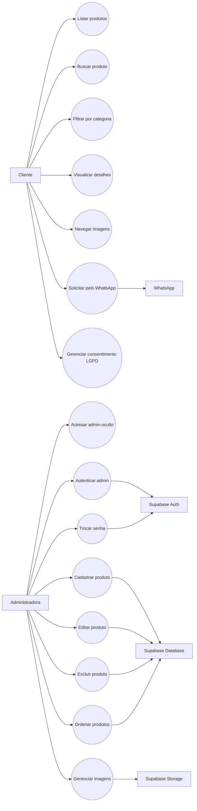

### 7.2 Descricao dos Principais Casos de Uso

#### UC01 - Visualizar Loja

Ator principal: Cliente.

Fluxo principal:

1. Cliente acessa a pagina inicial.
2. Sistema busca produtos no Supabase.
3. Sistema ordena produtos por `display_order`.
4. Sistema renderiza cards de produtos.

Excecoes:

- Se a busca falhar, o sistema exibe mensagem de erro.
- Se `display_order` nao existir, o sistema usa ordenacao por `created_at`.

#### UC02 - Comprar ou Encomendar Produto

Ator principal: Cliente.

Fluxo principal:

1. Cliente abre os detalhes do produto.
2. Sistema mostra informacoes do produto.
3. Cliente aciona o botao de WhatsApp.
4. Sistema abre conversa com mensagem pronta.

#### UC03 - Gerenciar Produto

Ator principal: Administradora.

Fluxo principal:

1. Administradora acessa `?admin=1` ou `#admin`.
2. Sistema exibe tela de login.
3. Administradora informa credenciais.
4. Sistema autentica no Supabase Auth.
5. Sistema valida permissao em `admin_users`.
6. Administradora cadastra, edita, exclui ou ordena produtos.
7. Sistema persiste alteracoes no Supabase.

Excecoes:

- Credenciais invalidas bloqueiam acesso.
- Usuario sem permissao admin e desconectado.
- Erro de persistencia gera toast de erro.

## 8. Modelo de Dominio

### 8.1 Diagrama de Classes

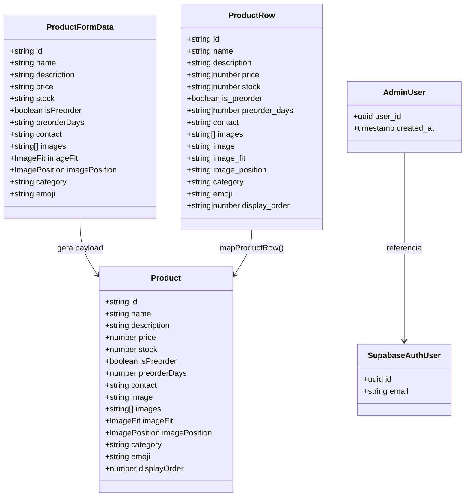

### 8.2 Enumeracoes

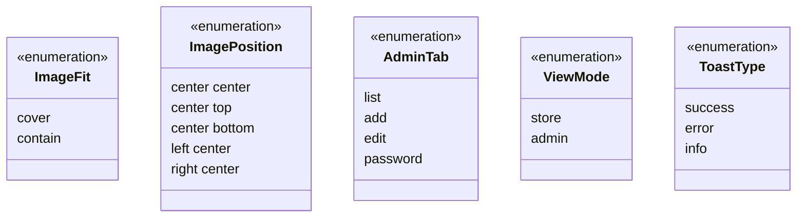

## 9. Modelo de Dados

### 9.1 Diagrama Entidade-Relacionamento

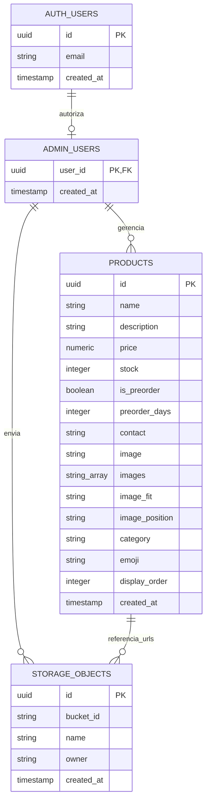

## 10. Arquitetura da Aplicacao

### 10.1 Diagrama de Componentes

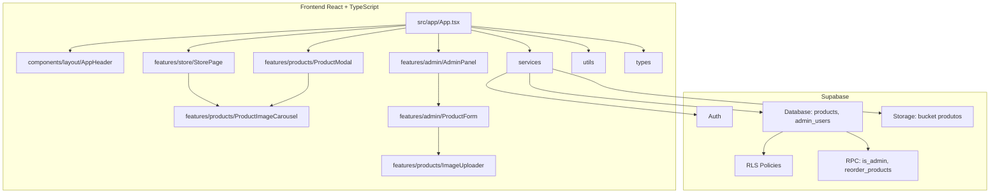

### 10.2 Camadas

| Camada | Responsabilidade |
| --- | --- |
| UI | Renderizacao, interacao e estado visual. |
| Features | Organizacao por dominio: loja, produtos e admin. |
| Services | Comunicacao com Supabase e Storage. |
| Utils | Formatacao e mapeamento de dados. |
| Types | Contratos TypeScript compartilhados. |
| Database | Persistencia e autorizacao por RLS. |

## 11. Diagramas de Sequencia

### 11.1 Carregamento da Loja

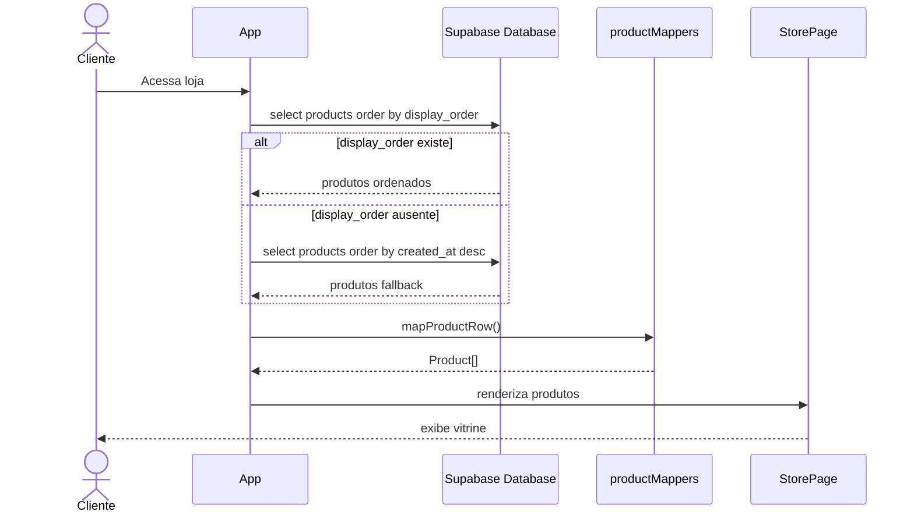

### 11.2 Login Administrativo

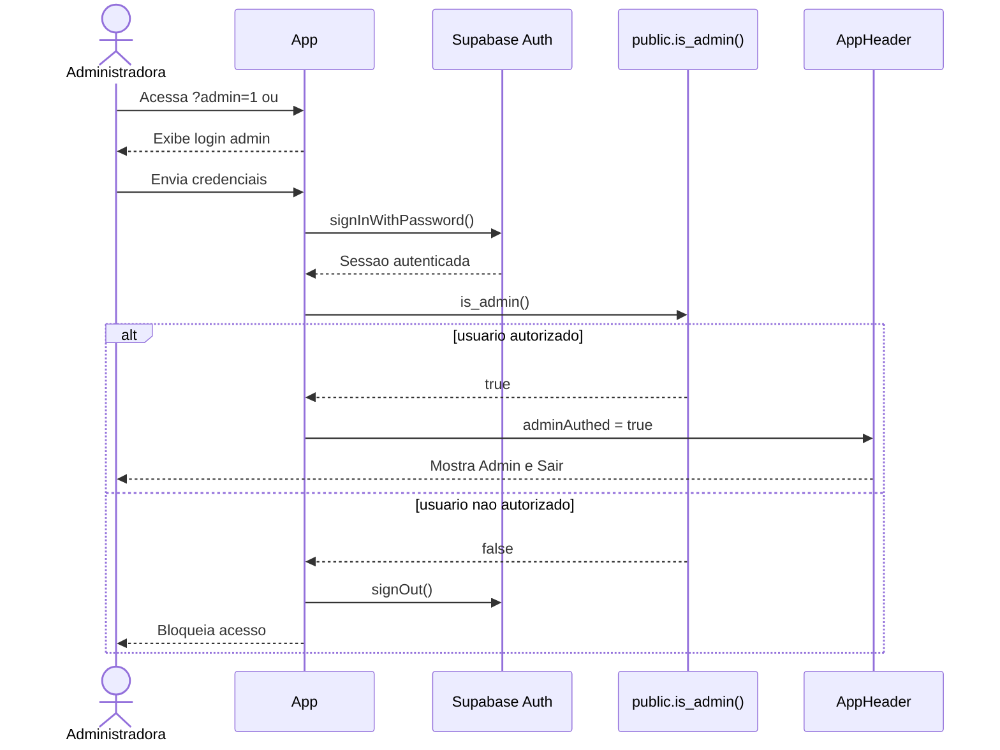

### 11.3 Cadastro de Produto com Imagem

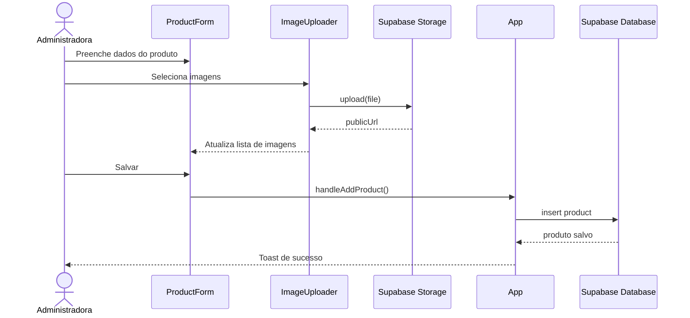

### 11.4 Reordenacao de Produtos

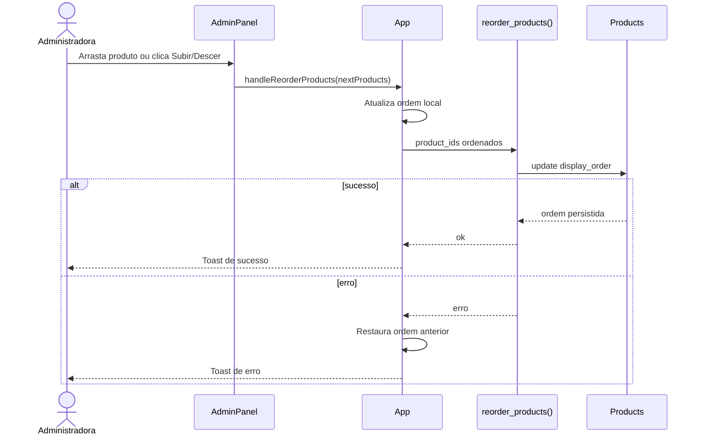

### 11.5 Navegacao Mobile de Imagens e Produtos

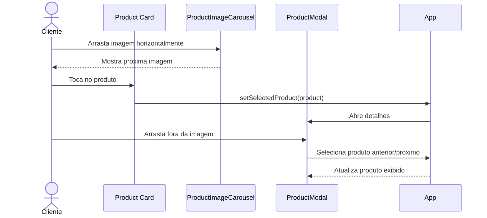

## 12. Diagrama de Estados

### 12.1 Estado da Sessao Administrativa

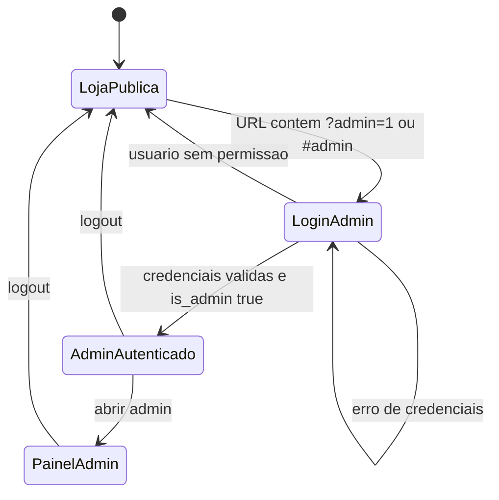

### 12.2 Estado do Produto no Admin

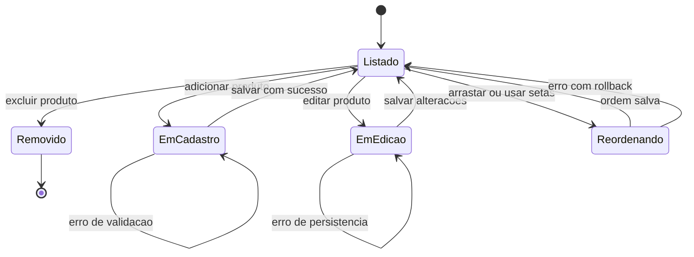

## 13. Diagrama de Atividades

### 13.1 Fluxo de Cadastro de Produto

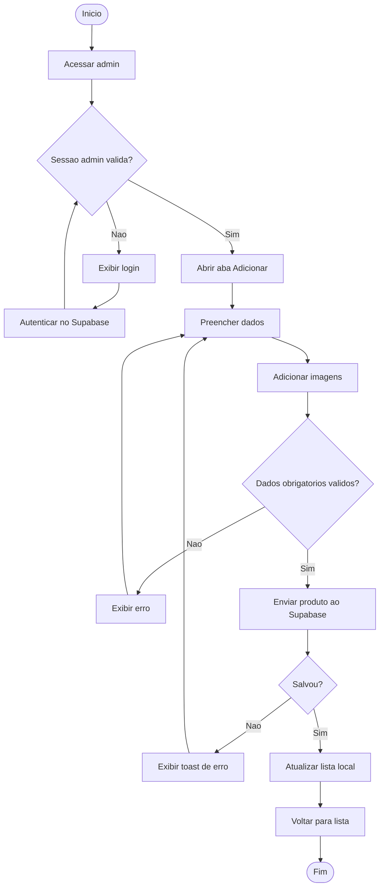

## 14. Matriz de Rastreabilidade

| Requisito | Implementacao Principal | Persistencia/Servico |
| --- | --- | --- |
| RF01 | `StorePage`, `App.tsx` | `products` |
| RF02 | `App.tsx`, `StorePage` | Estado local |
| RF03 | `App.tsx`, `StorePage` | Estado local |
| RF04 | `ProductModal` | Estado local |
| RF05 | `ProductImageCarousel` | Estado local |
| RF06 | `ProductModal` | WhatsApp |
| RF07 | `CookieBanner`, `PrivacyModal` | `localStorage` |
| RF08 | `AppHeader`, `App.tsx` | Supabase Auth |
| RF09 | `App.tsx` | `is_admin`, `admin_users` |
| RF10 | `ProductForm`, `App.tsx` | `products` |
| RF11 | `ProductForm`, `App.tsx` | `products` |
| RF12 | `AdminPanel`, `App.tsx` | `products` |
| RF13 | `AdminPanel`, `App.tsx` | `reorder_products` |
| RF14 | `ImageUploader` | `products.images` |
| RF15 | `productImageUpload.ts` | Supabase Storage |
| RF16 | `AdminPanel`, `App.tsx` | Supabase Auth |

## 15. Premissas

- A aplicacao sera executada em navegadores modernos.
- O Supabase estara configurado com URL e anon key validas.
- O bucket `produtos` existira antes do uso do upload.
- A conta administrativa sera criada manualmente em Supabase Auth.
- O UUID da administradora sera cadastrado em `public.admin_users`.
- A compactacao de imagens novas sera feita fora do frontend.

## 16. Riscos e Mitigacoes

| Risco | Impacto | Mitigacao |
| --- | --- | --- |
| RLS nao aplicada corretamente | Escrita indevida em produtos ou Storage | Executar e revisar `admin-security-policies.sql`. |
| Bucket ausente ou policy incorreta | Falha no upload de imagens | Criar bucket `produtos` e aplicar policies de Storage. |
| Migracao `display_order` ausente | Ordem manual nao persiste | Executar `add-product-display-order.sql`. |
| Imagens muito grandes | Lentidao na loja | Compactar imagens no backend. |
| Chaves privadas no frontend | Vazamento de credenciais | Usar somente anon key publica no `.env`. |
| Usuario Auth sem `admin_users` | Admin bloqueado | Inserir UUID correto na tabela `admin_users`. |

## 17. Criterios de Aceite Gerais

- Cliente nao ve acesso administrativo.
- Admin consegue acessar apenas apos autenticacao e autorizacao.
- Produtos aparecem ordenados conforme configurado no painel.
- Produto pode ter varias imagens.
- Imagens podem ser navegadas no desktop e no mobile.
- Gestos de imagem no mobile nao bloqueiam scroll vertical.
- Escritas no banco e Storage sao protegidas por RLS.
- Build de producao conclui sem erro.
- Lint conclui sem erro.
